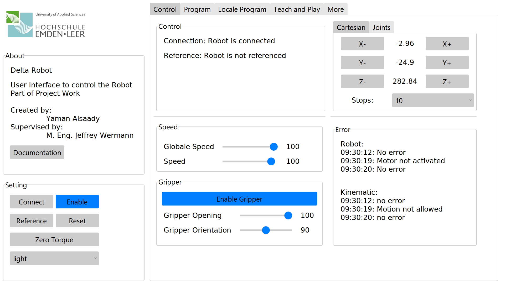
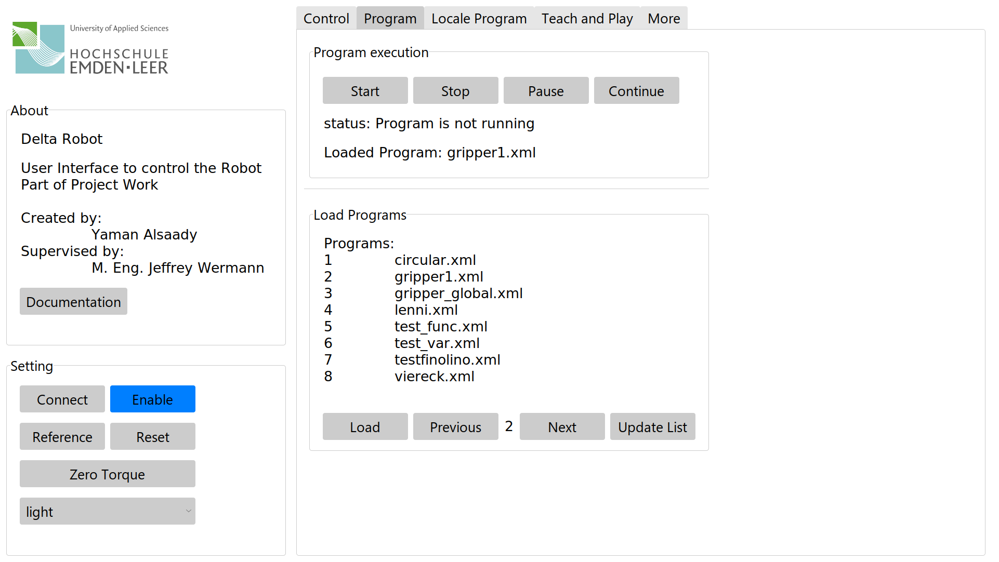
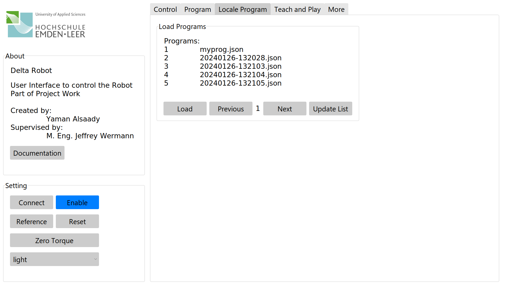
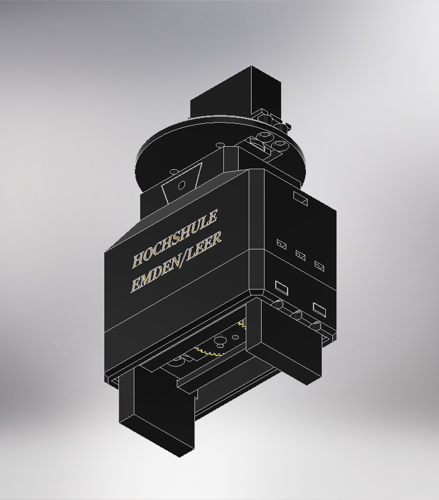
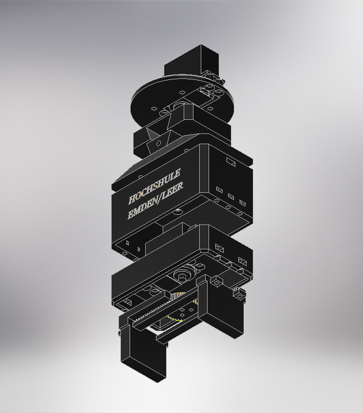
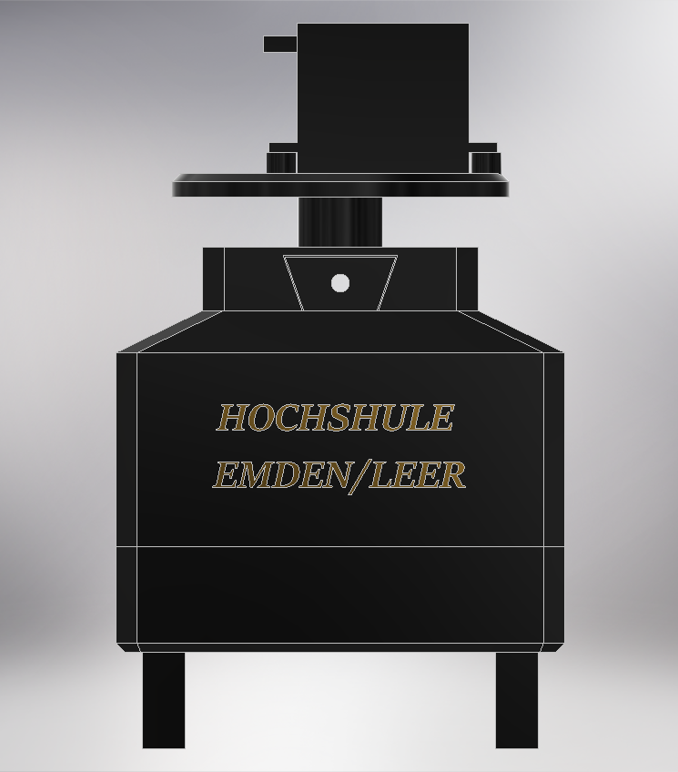

# Delta Robot Control System

This repository contains the Delta Robot Control System developed as a project work at the University of Applied Sciences Emden/Leer for controlling an igus Delta robot using Python and Modbus communication. The system includes an API for easy integration into industrial environments, a graphical user interface (GUI) for intuitive control, and functionality for controlling the gripper. 

## Table of Contents

- [About](#about)
- [Features](#features)
- [Installation](#installation)
- [Usage](#usage)
- [Examples](#examples)
- [Documentation](#documentation)
- [Images](images)
- [Notes](#notes)
- [Acknowledgements](#acknowledgements)


## About 
This project aims to integrate the Igus Delta robot into the digital factory at the University of Applied Sciences Emden/Leer. The digital factory is part of the implementation of Industry 4.0, where the establishment of a factory to realize Industry 4.0 concepts is planned. 

The goal of this project is to design and implement a custom API for controlling the Igus Delta robot in industrial settings, utilizing the Modbus TCP/IP protocol. Additionally, the project includes the development of a 3D-printed gripper with two servo motors for object manipulation, controlled by an ESP32 microcontroller. Creating a graphical user interface (GUI) enables on-site control without external devices and expands the robot's capabilities to meet practical production needs.

## Features
- **API:** Easily control the Delta robot through Python scripts using the provided API.
- **GUI:** Intuitive graphical interface for convenient control of the Delta robot and gripper.
- **Gripper Control:** Control the gripper functionality for picking and placing objects.

## Installation
### Connection with the Robot
To install and set up the Delta Robot Control System, follow these steps:

1. Clone this repository to your Raspberry Pi by running the following command in your terminal:
    ```bash 
    mkdir -p src
    git clone --depth=1 https://github.com/YAlsaady/IGUS_Delta_Robot.git ~/src
    ```

2. Install the required dependencies by running:
   ```bash
   pip install pyModbusTCP numpy pyserial
   ```


4. Ensure that the Raspberry Pi is connected to the same network as the Delta robot.

5. Assign a static IP address to the Raspberry Pi (e.g., 192.168.3.xxx). Note that the IP address 192.168.3.11 is used by the Delta robot and should not be used by any other device.

### Gripper Connection (Optional)
1. Upload the `Arduino/Gripper/Gripper.ino` to the ESP32
  
1. Connect the ESP32 to the Raspberry Pi via USB.

2. Connect the servo motors to the power supply.

3. Connect the servo motor for opening and closing the gripper to Pin 26.

4. Connect the servo motor for rotating the gripper to Pin 27.

## Usage
### API

1. Import the `Robot` class from the `igus_modbus` module.
2. Initialize the `Robot` object with the IP address of the Delta robot.
3. Check if the connection is successful before performing any actions.
```python
from src.igus_modbus import Robot

def main():
    # Initialize the Robot object with the IP address of the Delta robot
    delta = Robot("192.168.3.11")
    # Check if connection is successful
    if delta.is_connected:
        # Enable the robot
        delta.enable()
        # Perform actions with the robot
        # delta.Do_Something()
    else:
        print("No Connection")
```
Uncomment and modify the delta.Do_Something() line to perform specific actions with the robot.

Ensure that you have the necessary dependencies installed and that the Delta robot is connected to the network before running the code.
### GUI 
To launch the GUI, run the following command in your terminal:

```bash
python3 ~/src/IGUS_Delta_Robot/Modbus/main.py&
```
### Gripper
To control the gripper over Modbus, run the following command in your terminal:

```bash
python3 ~/src/IGUS_Delta_Robot/Modbus/gripper_global.py&
```
Note: The 'gripper_global.py' program needs to run continuously in the background to enable gripper control via Modbus.

## Examples
In the `Modbus/Example` directory, you'll find three sample programs demonstrating how to use the library. These examples serve as a simple guide and starting point for developers to understand the basic functions of the library and apply them in their own projects. We'll walk through typical actions step by step, starting with initiating communication, moving the robot, reading and controlling loaded programs, and finally controlling the gripper.

To run an example, follow these steps:

1. Navigate to the Modbus directory.
2. Run the example.py script using Python.
3. Choose an example by entering the corresponding number when prompted.
Make sure you have the necessary dependencies installed before running the examples.

### Example 1: Movement in a Rectangle
This example demonstrates how to move the Delta robot in a rectangular pattern. It begins by establishing a connection to the robot, and if successful, performs some basic movements.
```python
from src.igus_modbus import Robot

def main():
    delta = Robot("192.168.3.11")
    wait = True

    if delta.is_connected:
        delta.enable()
        delta.reference()

        delta.set_velocity(500)
        delta.set_position_endeffector(-200, -200, 150)
        delta.move_endeffector(wait)

        delta.set_position_endeffector(200, -200, 150)
        delta.move_endeffector(wait)

        delta.set_position_endeffector(200, 200, 150)
        delta.move_endeffector(wait)

        delta.set_position_endeffector(-200, 200, 150)
        delta.move_endeffector(wait)
    else:
        print("No Connection")
```
### Example 2: Program Control
This example shows how to control programs on the Delta robot. It demonstrates the selection of a program, starting, stopping, pausing, and resuming execution.
```python
from src.igus_modbus import Robot

def main():
    delta = Robot("192.168.3.11")

    if delta.is_connected:
        delta.enable()
        delta.reference()
        delta.set_override_velocity(50)

        delta.print_list_of_programs()
        print("select a program\n")

        num = input()
        name = delta.get_list_of_porgrams(num)
        delta.set_program_name(name)
        
        print("select an action:\n 1. start\n 2. stop\n 3. pause\n 4. continue\n")
        action = input()


        delta.controll_programs(action)
    else:
        print("No Connection")
```
### Example 3: Gripper Control
This example demonstrates controlling the gripper with the Delta robot. The following code provide an overview of the basic functions for controlling the gripper.
```python
from src.igus_modbus import Robot

def main():
    delta = Robot("192.168.3.11")

    if delta.is_connected:
        delta.enable()
        delta.reference()

        delta.set_override_velocity(50)

        delta.set_and_move(
              0 ,
              0,
              150,
              movement = "cartesian",
              relative = None,
              wait = True,
              velocity = 2000
        )

        delta.control_gripper(100,90)
        delta.set_and_move(0 , 0, 250)
        delta.control_gripper(0,90)
        delta.set_and_move(0 , 0, 150)
        delta.control_gripper(0,180)
        delta.set_and_move(0 , 0, 250)
        delta.control_gripper(100,180)
        delta.set_and_move(0 , 0, 150)
    else:
        print("No Connection")
```

## Documentation
Additional documentation, including API reference, can be found in the `Modbus/docs` directory of this repository.

## Images
### GUI
<div style="display: flex;">
    
    
    
    
</div>

### Gripper
<div style="display: flex; justify-content: space-between;">
    
    
    
</div>

## Notes
- This project is still under development and may contain bugs or limitations.

## Acknowledgements
This project utilizes the following libraries and resources:
- **[pymodbusTCP](https://github.com/sourceperl/pyModbusTCP):** Used for communication with the Delta robot via the Modbus TCP/IP protocol.
- **[Azure-ttk-theme](https://github.com/rdbende/Azure-ttk-theme):** Served as the basis for developing the graphical user interface (GUI), enhancing the aesthetics and functionality of the interface.

